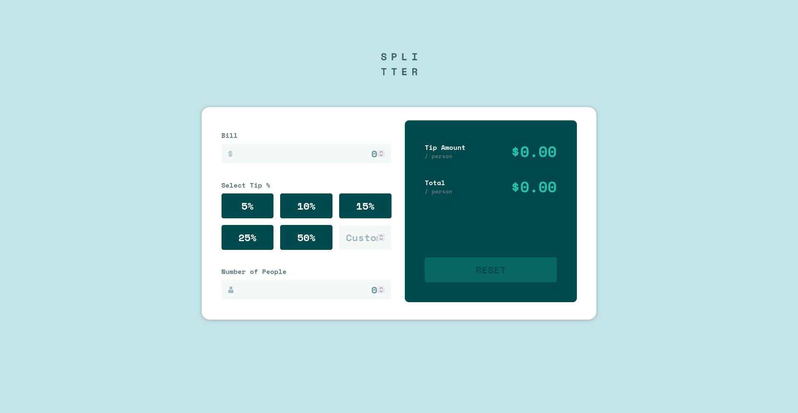

# Frontend Mentor - Tip calculator app solution

This is a solution to the [Tip calculator app challenge on Frontend Mentor](https://www.frontendmentor.io/challenges/tip-calculator-app-ugJNGbJUX). Frontend Mentor challenges help you improve your coding skills by building realistic projects.

## Table of contents

- [Overview](#overview)
  - [The challenge](#the-challenge)
  - [Screenshot](#screenshot)
  - [Links](#links)
- [My process](#my-process)
  - [Built with](#built-with)
  - [Useful resources](#useful-resources)
- [Author](#author)
- [Acknowledgments](#acknowledgments)

## Overview

### The challenge

Users should be able to:

- View the optimal layout for the app depending on their device's screen size
- See hover states for all interactive elements on the page
- Calculate the correct tip and total cost of the bill per person

### Screenshot

### Links

- Solution URL: [FrontEndMentor Splitter Submission](https://your-solution-url.com)
- Live Site URL: [Splitter Reactive Tip Calculator](https://splitter-reactive-tip-calculator.netlify.app/)

## My process

As with most of my projects, I begin designing the mobile layout. I first developed the header and main card-style body which will later hold the entirety of the project. In order to get this design to feel right, I had to ensure the input field looked and functioned as it should. I first started with the input fields, paying special attention to the small icons that appear in them, followed by the tip selection buttons. At this point, I was unsure about how to approach the issue of accessibility within my input field. I ultimately ended up utilizing the "aria-label" attribute to increase the overall usability of the application. Towards the end of the development process of the mobile design, I began to work on the functionality of the calculator itself. After squashing many bugs, I ended up with a working tip calculator. As a final step, I introduced media queries to implement a proper layou for those viewing the application on a tablets as well as a desktop display.

### Built with

- [ReactJS](https://reactjs.org/)
- Mobile-first workflow
- Semantic HTML5 markup
- Component-Scoped Styles with CSS Modules
- Flexbox
- CSS Grid

### Useful resources

- ["ARIA14: Using aria-label to provide an invisible label where a visible label cannot be used"](https://www.https://www.w3.org/TR/WCAG20-TECHS/ARIA14.html.com) - This helped me for XYZ reason. I really liked this pattern and will use it going forward.

## Author

- Frontend Mentor - [@tkressma](https://www.frontendmentor.io/profile/tkressma)
- Twitter - [@tom_kressman](https://twitter.com/tom_kressman

## Acknowledgments

The many ensightful developers over at stackoverflow :^)
